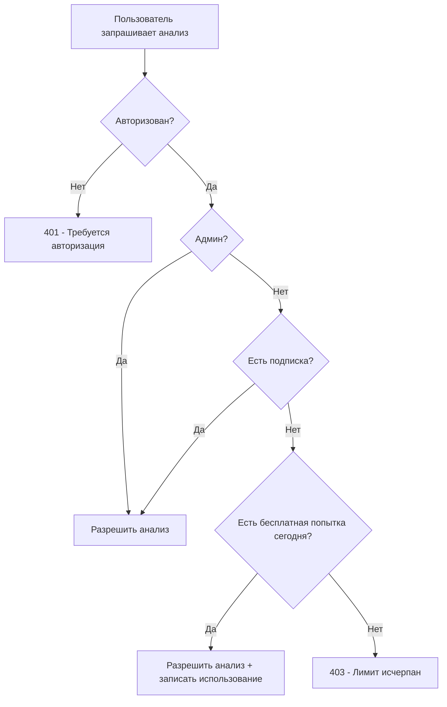

# 🎁 Free Trial System Setup Guide

## Обзор

Система бесплатных попыток позволяет новым пользователям тестировать продукт с **1 бесплатным анализом в день** до оформления платной подписки.

## Что изменилось?

### До внедрения:

- ❌ Пользователи без подписки не могли делать анализы
- ❌ Нет возможности протестировать продукт перед покупкой

### После внедрения:

- ✅ Новые пользователи получают 1 бесплатный анализ в день
- ✅ Лимит сбрасывается каждый день (00:00 UTC)
- ✅ Пользователи с подпиской получают неограниченный доступ
- ✅ Админы не ограничены

## Архитектура

### База данных

**Новая таблица: `daily_free_analyses`**

```sql
- user_id: UUID (ссылка на auth.users)
- analysis_date: DATE (дата анализа)
- analysis_count: INTEGER (количество анализов за день)
- last_analysis_timestamp: TIMESTAMPTZ
- profile_analyzed: TEXT (какой профиль был проанализирован)
```

**Новые функции:**

- `can_use_free_trial(user_id)` - проверяет, может ли пользователь использовать бесплатную попытку
- `record_free_trial_usage(user_id, profile)` - записывает использование бесплатной попытки
- `get_free_trial_info(user_id)` - получает детальную информацию о бесплатных попытках

### Backend (Python)

**Новые функции в `supabase_client.py`:**

- `can_use_free_trial(user_id)` - проверка доступности бесплатной попытки
- `record_free_trial_usage(user_id, profile)` - запись использования
- `get_free_trial_info(user_id)` - получение информации
- `check_user_can_analyze(user_id)` - универсальная проверка доступа (подписка или бесплатная попытка)

**Обновленный endpoint `/api/v1/analyze`:**

- Теперь проверяет не только подписку, но и бесплатные попытки
- Записывает использование бесплатной попытки после успешного анализа
- Возвращает детальную информацию об ошибках с типом доступа

**Новый endpoint `/api/v1/free-trial/info`:**

- Получение статуса бесплатных попыток
- Информация о количестве использованных попыток
- Сообщения для UI

## Установка

### Шаг 1: Применить миграцию в Supabase

1. Открыть Supabase Dashboard
2. Перейти в SQL Editor
3. Скопировать содержимое файла `backend/supabase_free_trial_migration.sql`
4. Выполнить SQL запрос

### Шаг 2: Проверить миграцию

```sql
-- Проверить наличие таблицы
SELECT * FROM public.daily_free_analyses LIMIT 1;

-- Проверить функции
SELECT public.can_use_free_trial('your-user-uuid');
```

### Шаг 3: Перезапустить backend

```bash
# Локально
cd backend
python main.py

# Railway/Vercel - автоматически после деплоя
```

### Шаг 4: Тестирование

#### Тест 1: Первая бесплатная попытка

```bash
# Зарегистрировать нового пользователя
# Сделать анализ профиля
# Должно работать успешно ✅
```

#### Тест 2: Вторая попытка в тот же день

```bash
# Попробовать сделать второй анализ
# Должна быть ошибка 403 с сообщением о лимите ❌
```

#### Тест 3: Следующий день

```bash
# Подождать до следующего дня (или изменить системное время)
# Попробовать сделать анализ
# Должно работать успешно ✅
```

#### Тест 4: Пользователь с подпиской

```bash
# Оформить подписку
# Делать неограниченное количество анализов
# Все должно работать ✅
```

## API Endpoints

### GET `/api/v1/free-trial/info`

Получить информацию о бесплатных попытках пользователя.

**Требования:** Авторизация (Bearer token)

**Пример ответа (пользователь без подписки):**

```json
{
  "is_admin": false,
  "has_subscription": false,
  "can_use_free_trial": true,
  "today_count": 0,
  "total_free_analyses": 5,
  "daily_limit": 1,
  "message": "You have 1 free analysis available today"
}
```

**Пример ответа (лимит исчерпан):**

```json
{
  "is_admin": false,
  "has_subscription": false,
  "can_use_free_trial": false,
  "today_count": 1,
  "total_free_analyses": 5,
  "daily_limit": 1,
  "message": "You have used 1/1 free analyses today"
}
```

### POST `/api/v1/analyze`

Анализ TikTok профиля. Теперь работает с бесплатными попытками.

**Ошибка 403 (лимит исчерпан):**

```json
{
  "detail": {
    "error": "Analysis limit reached",
    "message": "You've used your free daily analysis. Subscribe to get unlimited access!",
    "today_count": 1,
    "action": "subscribe",
    "type": "free_trial_exhausted"
  }
}
```

## Логика работы



## Мониторинг

### Посмотреть статистику использования бесплатных попыток

```sql
-- Количество пользователей, использующих бесплатные попытки
SELECT COUNT(DISTINCT user_id) as free_users
FROM daily_free_analyses
WHERE analysis_date = CURRENT_DATE;

-- Топ-10 активных пользователей бесплатных попыток
SELECT
    user_id,
    COUNT(*) as total_analyses,
    MAX(last_analysis_timestamp) as last_used
FROM daily_free_analyses
GROUP BY user_id
ORDER BY total_analyses DESC
LIMIT 10;

-- Конверсия: пользователи, которые перешли на подписку после бесплатных попыток
SELECT
    dfa.user_id,
    COUNT(dfa.id) as free_analyses_used,
    p.stripe_subscription_status as subscription_status
FROM daily_free_analyses dfa
JOIN profiles p ON dfa.user_id = p.id
WHERE p.stripe_subscription_status IN ('active', 'trialing')
GROUP BY dfa.user_id, p.stripe_subscription_status;
```

## Настройки

### Изменить лимит бесплатных попыток

По умолчанию: **1 попытка в день**

Чтобы изменить лимит, обновите функцию `can_use_free_trial` в SQL:

```sql
-- Изменить лимит с 1 на 3 попытки в день
CREATE OR REPLACE FUNCTION public.can_use_free_trial(p_user_id UUID)
RETURNS BOOLEAN
LANGUAGE plpgsql
SECURITY DEFINER
AS $$
DECLARE
    v_today_count INTEGER;
    v_has_subscription BOOLEAN;
BEGIN
    -- ... (код проверки подписки)

    -- Изменить это число для другого лимита
    RETURN (v_today_count < 3);  -- Было: < 1
END;
$$;
```

### Очистка старых записей

Автоматическая очистка записей старше 90 дней:

```sql
-- Запустить вручную
SELECT public.cleanup_old_free_trial_records();

-- Или создать cron job в Supabase (pg_cron)
SELECT cron.schedule(
    'cleanup-free-trial-records',
    '0 2 * * *',  -- Каждый день в 2:00 AM
    $$SELECT public.cleanup_old_free_trial_records()$$
);
```

## Troubleshooting

### Проблема: Функции не найдены

**Ошибка:**

```
ERROR: function public.can_use_free_trial(uuid) does not exist
```

**Решение:**

1. Убедитесь, что миграция применена
2. Проверьте, что функции созданы:

```sql
SELECT proname FROM pg_proc WHERE proname LIKE '%free_trial%';
```

### Проблема: Пользователь не может использовать бесплатную попытку

**Проверка:**

```sql
-- Проверить запись в таблице
SELECT * FROM daily_free_analyses
WHERE user_id = 'your-user-uuid'
AND analysis_date = CURRENT_DATE;

-- Проверить функцию
SELECT public.can_use_free_trial('your-user-uuid');
```

**Сброс счетчика для тестирования:**

```sql
-- Удалить запись за сегодня
DELETE FROM daily_free_analyses
WHERE user_id = 'your-user-uuid'
AND analysis_date = CURRENT_DATE;
```

### Проблема: Backend ошибки

**Проверка логов:**

```bash
# Локально
tail -f logs/backend.log | grep "free_trial"

# Railway
railway logs
```

## Безопасность

- ✅ Row Level Security (RLS) включен для таблицы `daily_free_analyses`
- ✅ Пользователи могут видеть только свои записи
- ✅ Функции выполняются с правами `SECURITY DEFINER`
- ✅ Невозможно обойти лимиты через API

## Метрики успеха

Отслеживайте:

1. **Конверсия в подписку** - сколько пользователей подписываются после бесплатных попыток
2. **Удержание** - сколько пользователей возвращаются на следующий день
3. **Активность** - среднее количество дней использования бесплатных попыток до подписки

## Поддержка

Если возникли проблемы:

1. Проверьте логи backend
2. Проверьте, что миграция применена
3. Проверьте права доступа в Supabase
4. Откройте issue в GitHub

---

**Версия:** 1.0.0  
**Дата:** 2025-10-03  
**Автор:** TrendXL Team
